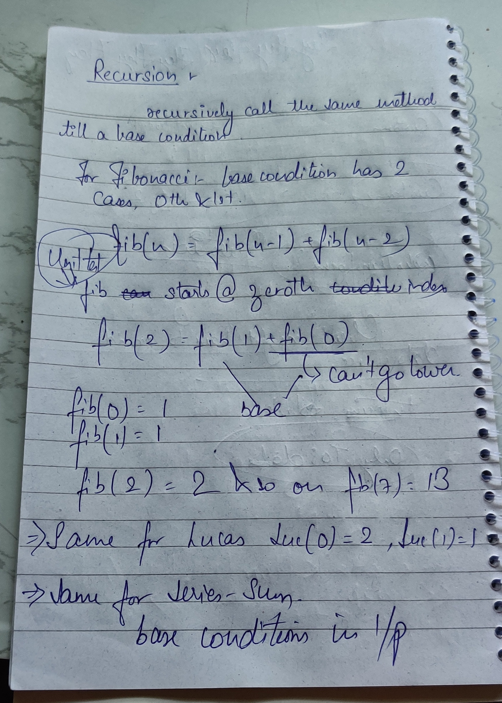

# Math Series

## Challenge

* Create a function called fibonacci. The function should have one parameter n. The function should return the nth value
 in the fibonacci series. You may implement the function using recursion or iteration. If you are feeling particularly
 frisky, do both as separate functions.
* Ensure that your function(s) has a well-formed docstring
* In your series.py module, add a new function lucas that returns the nth value in the lucas numbers Again, you may use
recursion or iteration, or both. Again, ensure that your function has a well-formed docstring.
* Both the fibonacci series and the lucas numbers are based on an identical formula. Add a third function called
sum_series with one required parameter and two optional parameters. The required parameter will determine which
element in the series to print. The two optional parameters will have default values of 0 and 1 and will determine the
first two values for the series to be produced.
* Calling this function with no optional parameters will produce numbers from the fibonacci series. Calling it with the
optional arguments 2 and 1 will produce values from the lucas numbers. Other values for the optional parameters will
produce other series. Again, you may use recursion or iteration, or both. Again, ensure that your function has a
well-formed docstring.
* Add your series.py and test_series.py modules to your repository and commit frequently while working on your
implementation. Include good commit messages that explain concisely both what you are doing and why.

## User Acceptance Tests

Your test requirements for today are simple. Do what you can, but try. Flex those new muscles!!

## Approach & Efficiency

Fibonacci is a classic recursion problem. All three problems have base conditions in 0th and 1st values. Fibonacci and
Lucas use standard first two values whereas sum-series expects those as parameters. The change here is the approach of
using TDD. Tests were written first and then code to satisfy those tests. The same approach will follow for Lucas and
series-sum methods.

## Solution

## Pull Request link

https://github.com/kaliadevansh/math-series/pull/1
